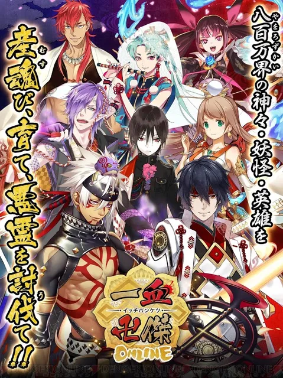
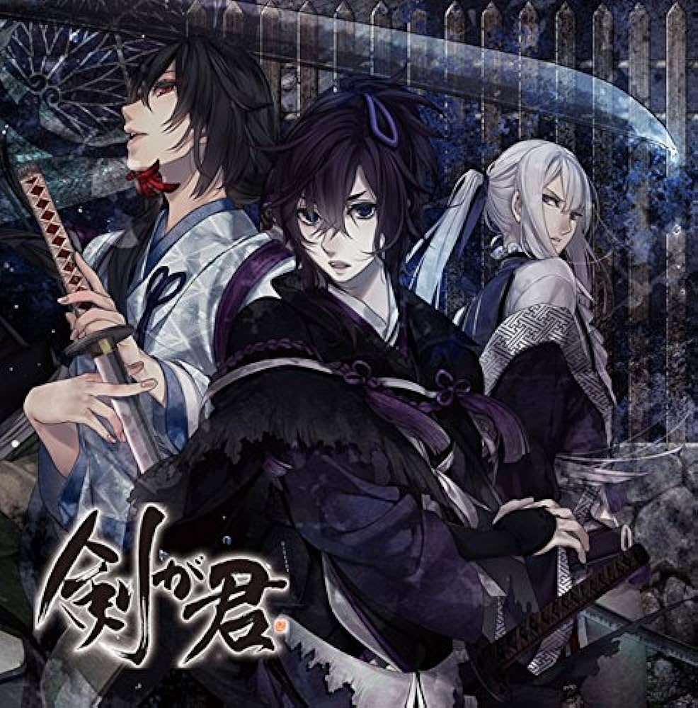

## Name
広木宏 / hiromu_dev

## Job
ライター / プログラマ

## Career
乙女ゲーム会社のディレクター/ライターとして、コンシューマ/ソシャゲ/シチュCDなどの案件を担当する。
その後、システム開発会社にプログラマとして転職。
出向先企業にて評価され、転職オファーを受け現職。プログラマ/PM/AIリードとして職務にあたる。

現在はプログラマとして働く傍らゲーム会社時代の経験を活かしてライターとしても活動。

## Skill
- WEB記事執筆
- シナリオライティング
- シチュエーションCD台本作成
 
## Game/CD
帝國スタァ シリーズ (女性向シチュエーションCD)
□ ディレクター / シナリオディレクター / 一部本編シナリオ

### クリミナーレ! シリーズ (女性向シチュエーションCD)
□ ディレクター / シナリオディレクター / 一部特典シナリオ

### 我が掌で踊れ (女性向シチュエーションCD)
□ ディレクター / シナリオディレクター

### 一血卍傑 (PC/スマホ ソーシャルゲーム) ※サービス終了
□ ディレクター

### 剣が君 (PC/Vita コンシューマ)
□ アシスタントディレクター

## Programming

## Others
[Linrs -音楽に携わる全ての職人のためのデータベース-](https://linrs.herokuapp.com/)

[MabatakiNews -ニュース速読-](http://mabataki-news-ce0544a64471.herokuapp.com/)

[DMM Webサービス APIリファレンス](https://github.com/mgmyst/dmm-web-service-api-reference)

[ピナクルAPIドキュメント(日本語訳)](https://github.com/mgmyst/pinnacleapi-documentation-ja)
